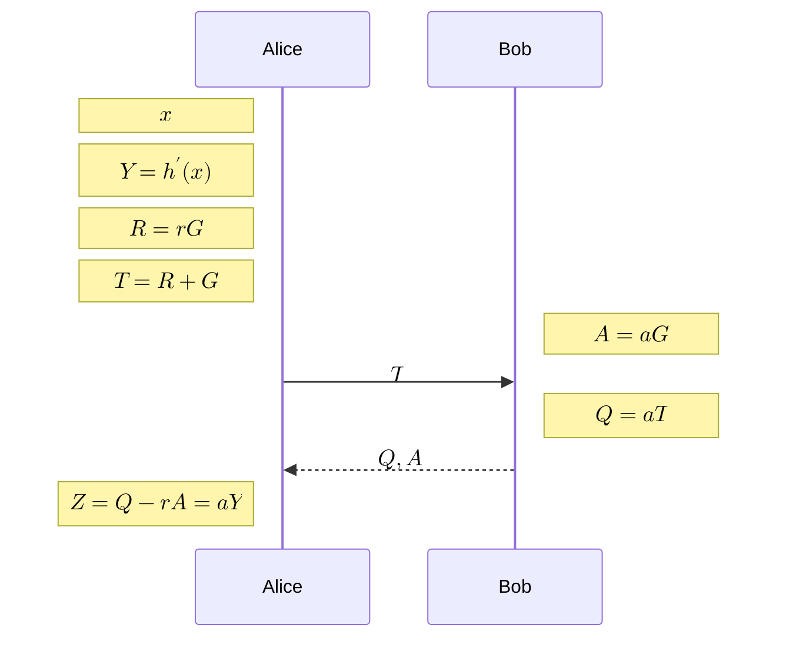
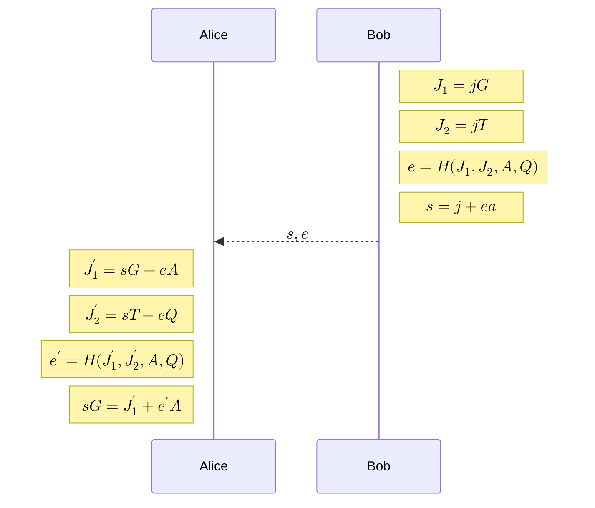

# Cashu

Blind Diffie-Hellman Key Exchange & Discrete Logarithm Equivalence

  
  

    
jaonoctus

    
Vinteum Discord - Jul. 14th, 2025

  

  <a href="https://discord.gg/vinteum" target="_blank" class="slidev-icon-btn">
    <carbon:logo-discord />
  </a>

---
layout: intro
---

# Jão Noctus

SWE at ZBD   Developer Advocate at VinteUm

- 
    <carbon:link />
    <a href="https://jaonoctus.dev" target="_blank">
      jaonoctus.dev
    </a>
  
- 
    <carbon:logo-github />
    <a href="https://github.com/jaonoctus" target="_blank">
      jaonoctus
    </a>
  
- 
    <carbon:logo-x />
    <a href="https://x.com/jaonoctus" target="_blank">
      jaonoctus
    </a>
  
- 
    <carbon:email />
    <a href="mailto:jaonoctus@protonmail.com" target="_blank">
      jaonoctus@protonmail.com
    </a>
  
- 
    <carbon:logo-keybase />
    <a href="https://keybase.io/jaonoctus" target="_blank">
      0x7B69<b class="text-orange">6A616F</b>73<b class="text-orange">1337</b>520B8A19<b class="text-purple">D8F31505B581D617</b>
    </a>
  
---

# Introduction
Privacy with Cashu

<Youtube id="r1putHnAwyY" />

---
layout: statement
---

# BDHKE

Blind Diffie-Hellman Key Exchange   <a href="https://github.com/cashubtc/nuts/blob/main/00.md" target="_blank">NUT-00</a>

---
layout: two-cols
---

### Alice (User)

$$
\begin{aligned}
x &\leftarrow \{0,1\}^{256} \\
r &\leftarrow \mathbb{Z}_n \\
R &= rG \\
Y &= \text{HashToCurve}(x) \\
T &= Y + R \\
Z &= Q - rA = aY
\end{aligned}
$$

::right::

### Bob (Mint)

$$
\begin{aligned}
a &\leftarrow \mathbb{Z}_n \\
A &= aG \\
Q &= aT \\
\end{aligned}
$$

---
layout: full
---

---

# Why

does $Z = aY$ hold?

$$
\begin{aligned}
Z &= Q - rA \\
&= aT - raG \quad \text{(since } Q = aT,\ A = aG) \\
&= a(Y + R) - raG \quad \text{(substitute } T = Y + R) \\
&= aY + aR - raG \quad \text{(distribute } a) \\
&= aY + raG - raG \quad \text{(since } R = rG,\ aR = raG) \\
&= aY \quad \text{(the blinding term cancels out)}
\end{aligned}
$$

- The blinding term cancels out.
- Alice recovers a valid signature on $Y$.
- Bob never sees $Y$.

---
layout: statement
---

# DLEQ

Discrete Logarithm Equivalence   <a href="https://github.com/cashubtc/nuts/blob/main/12.md" target="_blank">NUT-12</a>

---
layout: two-cols
---

### Alice (User / Verifier)

$$
\begin{aligned}
J_1' &= sG - eA \\
J_2' &= sT - eQ \\
e' &= \mathsf{H}(J_1', J_2', A, Q) \\
\text{Accept if } e' &= e \\
sG &= J_1' + e'(J_1', J_2', A, Q)A \quad \text{(signature verification)}
\end{aligned}
$$

::right::

### Bob (Mint / Prover)

$$
\begin{aligned}
j &\leftarrow \mathbb{Z}_n \\
J_1 &= jG \\
J_2 &= jT \\
e &= \mathsf{H}(J_1, J_2, A, Q) \\
s &= j + ea
\end{aligned}
$$

---
layout: full
---

---

# Why

does $J_1' = J_1$ hold?

$$
\begin{aligned}
s &= j + ea \\
j &= s - ea \quad \text{(isolating } j \text{)} \\
J_1 &= jG \\
&= (s - ea)G \quad \text{(substitute } j \text{)} \\
&= sG - eaG \quad \text{(distribute scalar multiplication)} \\
&= sG - eA \quad \text{(since } A = aG) \\
J_1' &= sG - eA = J_1
\end{aligned}
$$

---
layout: full
---

# Why

does $J_2' = J_2$ hold?

$$
\begin{aligned}
s &= j + ea \\
j &= s - ea \quad \text{(isolating $j$)} \\
J_2 &= jT \\
&= (s - ea)T \quad \text{(substitute $j$)} \\
&= sT - eaT \quad \text{(distribute scalar multiplication)} \\
&= sT - eQ \quad \text{(since $Q = aT$)} \\
J_2' &= sT - eQ = J_2
\end{aligned}
$$

---
layout: full
---

# I want to see it in action!

- [sage code](https://sagecell.sagemath.org/?z=eJydVttu6kYUfUfiH0agKvYJIN9tIuXBIZAe1DYhQUcibWUZGLBzjO3a4xSkPPQf-of9ku6ZMbYx5vTiBzCz176tvdeILur3--gFkyxGKV7Fim58lelZuxWjWyTtJ__vGbPPkTJpt1xnlSXvuIeW_IWG7SGz3RrD2zgI_Jj4qxG1CA8TIRZ76Oe6y69iu_VA0UK7heDRdckwFEOVFEUxTVVTDWOom5YpW9ZQlw1LhyPFUAAlqZqumqapDzXZBDdJtkwVTq2hLBumMlQ0qcdjgoMp6bIkKZKpW5ZsDE1LslTJ0mVV0iVT0lTZ0jRTVkxVtSRDB19VgcAQC2yqbupgMDVL0RQNYkLJ4b9hcHxn2-P70diwJ5plS-rd3eRe0cfW6F5SDU3W5Har3fJ3cZQQ5LmpF_jLdmuTRDuUuOEavnIb_eWHpMBGKXXssvmOojAlbkhSPtn7xx_tzz85L-Mn-9mePz5DmcvOy3H6zveQZR6xiTgjeM-cThmKGvsk6vNRQq4A73BIXOJHIY--xhtWqEMiPj1h73h4f4NSkog3nOxOp_P56JqiBRTgXQl7EY65fe8sDwSntDD6PaD9QgweSeSYVZSFBCeUY37wu-cHGM2TDOdZ6LNLtw6thqbg7A1Sz4VGhTMWro9pxcHa3-KUCGIZh5-cRyniXx8LGkDfLIyg9dBV4BMS4CuxKebeWdGhrV1CRQHDY33mzhwOEZb-9kpE36G4dCTJodIifeII3KlCBoG_IQ5lqogtnkITEHsSco_SgvcrHBMkfHGDDI-TJEp6yE584u0wyJMdiLWcxwFc3yK5XJCJ75K__vjzxXN3foJWnhsEONxixlu5IMU5I0_4xKpJjxkappU3sYkS9ARU8fLTSkX7HjqA29Ngf6hy7A2ymJIgABw2rByOqhy5vYQ-fAuds1gbmldMuTK4sCTHDvwVRkKW4kSE-5beuoySct-jdJBxYUNOkVpg4-E8RwyoCkQakC5-rnlB7iEQH5LBQMWcoE_oATU_XcQQDzTEIqe5plSxgBbCbLfm8LqAJX--FLYAlN3eRUsk7KDAk17d5sJtOHYvF95FDAB1z3Lg_BKQAeZlGfc_jGcoTqJog7Y4xEnlrnprrmUqw_nbxWK6iAOgmKmSI5urASQDsGqoyGt7P4WkU1gtu4dmYu5BYdSCPqjzB_T9AcZ2i26H8AYMY0jnssVqyJeyegDk1rcuC5eBH65TRDyMUn8burDBmPPwCl4zaJ5ujt0QtbCzISxq3L7jxN_4qwqvU9lZeXj1FdApo7HPqraLgFP5itqYwaY0nuDnOX5WoZHhmWHGyCwczijlFkrs8S2nt8vLBfWlCIKsA_yb8-4G_poyWwS8RVgsG5xHX3F42qGQM4nXFRqZs8i7XxS1Namr3TrmpFu8KNO-Hpv9QrMdGOlVrh8zEmck_3OW0JXt_BJevlU6YgHbIwH-3MGVJd50euhYRm4sRI5uwbhg92dp5bcFMz3XTOWVQK3zo7VWXNMlUCmNq5pFsGvxuY6ZaXYh-EVpVzLkWmVxpnItRy5PblRqxmYlMiwuUaXimCU9r_Kf9FcptiY0FvH1W83XtXfSeEVjeft8285IqIgrp6IRyDOy7T3VC12rUk7npf53FZ1ywrgQeGZCY7GMPNnf8-daBA==&lang=sage&interacts=eJyLjgUAARUAuQ==)
- [gist](https://gist.github.com/jaonoctus/ec40e7b8ecdf77918281f07ef147ac28)

---
layout: fact
---

# Obrigado

### "Don't trust, Verify. Cypherpunks write <s>code</s> slides with formulas."

